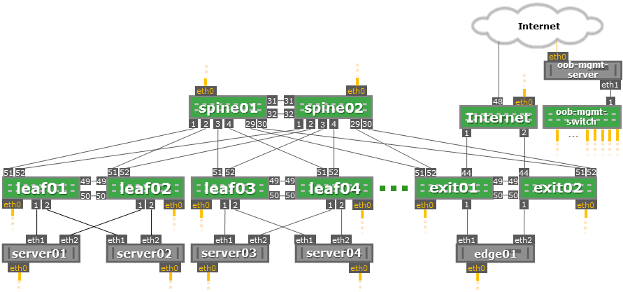

#Jumpstart Summary Report

###Prepared by Cumulus Networks® Professional Services

Presented to {{CUSTOMER}}  
{{DATE}}
{{CUMULUS CONSULTANT}}

##Customer

#Table of Conents

* [Executive Summary](#executive-summary)
  * [Participants](#participants)
* [Summary of Deliverables](#summary-of-deliverables)
* [Architecture Highlights](#architecture-highlights)
* [Overview](#overview)
  * [Design Choices](#design-choices)
  * [Simulation Environment](#simulation-environment)
* [Jumpstart Checklist](#jumpstart-checklist)
  * [Discovery Meeting](#discovery-meeting)
  * [Simulation Buildout](#simulation-buildout)
  * [Simulation Handoff and Syncs](#simulation-handoff-and-syncs)
  * [Wrap-Up](#wrap-up)
* [Questions & Answers](#questions--answers)
* [Future Recommendations](#future-recommendations)

#Executive Summary

The Cumulus Networks team performed a Remote Jumpstart consulting service with {{CUSTOMER}} team on {{DATE}} through {{DATE}}. This service included knowledge transfer, review of data center architecture, simulation of network topology via vagrant, and flat file configurations in a GitHub directory for the customer to keep.

###Participants

| Name | Role | Company |
|---|---|---|
|  |  |  |
|  |  |  |

#Summary of Deliverables

| Topic | Comments |
|---|---|
| Network Design | [See Architecture Highlights Below](#architecture-highlights) |
|Git Repository|https://github.com/cumulusnetworks/{{CUSTOMER}} |
|Cumulus VX Simulation| Discussed how to set up the VX environment and demo to closely replicate what production will look like.  More information below.|
|Switch Configurations| Provided as flat files in the Github directory under /config |
|Information Gathering Document| Used during Initial Discovery Meeting: {{GOOGLE DOCS LINKS}} |
|Diagrams and Notes| Used during Initial Discovery Meeting {{GOOGLE DOCS LINKS}} |

#Architecture Highlights

| Topic | Details |
|---|---|
|Network Design Summary |  |
| DC Type | Single Tenant, multiple Applications |
|Network Hardware|  <ul><li>2 x (40Gb) x86</li> <li>4 x (10Gb) x86</li></ul> |
| OOB | 2 x (1Gb) |
| Host Applications | |
| Host Operating System |  |
| Host to ToR Connection |  |
| Bridge Type |  |
| Automation |  Ansible (opensource)|
| Routing |  |
| VXLAN |  |
| Openstack |  |
| Overlay |  |
| RoH |  |

#Overview

##Design Choices

##Simulation Environment

The VMs are stitched together using network bridges in KVM via Vagrant.  Vagrant is an open source tool for building complete development environments.  The directions for the simulation are stored on this Github page.  There is a tool called “Topology Converter” that has instructions stored under the Github repo Vagrant/ directory.  Topology Converter also has its own Git repository that is updated regularly: https://github.com/cumulusnetworks/topology_converter

  

#Jumpstart Checklist

###Discovery Meeting

| | Requirement | Comments |
|---|---|---|
|✓|Introduction, Scope, Schedule||
|✓|Review Cumulus Networks Questionnaire ||
|✓|Create Topology Diagram ||
|✓|Discuss Network technologies used and path of the packet through the network| |
|✓|Collect Inventory Information||

###Simulation Buildout

| | Requirement | Comments |
|---|---|---|
|✓|Create Github repository, add correct users||
|✓|Create topology .dot file for PTM and topology converter  ||
|✓|Generate vagrant file for simulation||
|✓|Create automation code for simulation|Ansible|
|✓|Test automation code on vagrant simulation|KVM|
|✓|Generate flat file configuration from automation code|in config/ directory|
|✓|Create detailed readme in Github directory|  |

###Simulation Handoff and Syncs

| | Requirement | Comments |
|---|---|---|
|✓|Schedule Simulation Handoff Meeting||
|-|Setup Simulation on their server/laptop  |Nested Virtualization is currently not tested or supported.  Need to use bare metal.|
|✓|Discuss and Review Configuration||
|✓|Make Changes as Necessary to Automation and Configurations | |
|✓|As Needed: Provide education on simulation and automation tools (e.g. Ansible, Vagrant, Git, etc) |KVM|
|✓|As Needed: Provide Q&A |Created private Slack Channel #{{CUSTOMER}}, added Q&A to this report|

###Wrap-Up

| | Requirement | Comments |
|---|---|---|
|✓|Provide important links for additional help | <ul><li>Community: https://community.cumulusnetworks.com/ </li><li>Support: https://community.cumulusnetworks.com/</li><li>Slack: https://slack.cumulusnetworks.com/</li><li>Get Additional Services https://cumulusnetworks.com/support/consulting/</li>
|✓|Provide jumpstart summary document (this document) ||

#Questions & Answers

|Question| Answers |
|---|---|
| Q? | A |
|  |  |
|  |  | 

#Future Recommendations

| Recommendation|Details |
|---|---|
|  |  |
|  |  |

---
  
>©2016 Cumulus Networks. CUMULUS, the Cumulus Logo, CUMULUS NETWORKS, and the Rocket Turtle Logo (the “Marks”) are trademarks and service marks of Cumulus Networks, Inc. in the U.S. and other countries. You are not permitted to use the Marks without the prior written consent of Cumulus Networks. The registered trademark Linux® is used pursuant to a sublicense from LMI, the exclusive licensee of Linus Torvalds, owner of the mark on a world-wide basis. All other marks are used under fair use or license from their respective owners.
